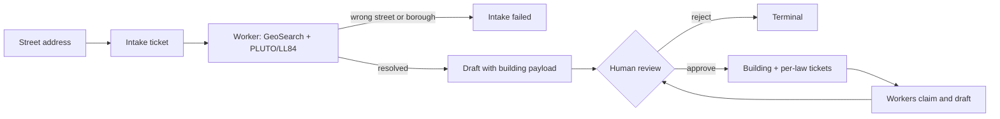

<h1 align="center">fineprint</h1>

<p align="center">
  <strong>NYC local-law compliance, run as a live ops room.</strong><br />
  Add a building and every obligation becomes a deadline-tracked ticket.
  AI workers draft the filings; a human approves every one.
</p>

<p align="center">
  
  
  
  
  
</p>

---

NYC buildings answer to a stack of local laws with real deadlines and real fines: LL97 emissions caps, LL11 facade inspections, LL84 benchmarking, LL87 audits, LL88 lighting, LL152 gas piping, LL55 allergens. fineprint tracks all of them per building, estimates the fine exposure, and runs the remediation work as a ticket queue.

Kill a worker mid-ticket. Within 15 seconds the ticket is back in the queue and another worker has it. That recovery is the demo.

---

## What it does

<table>
  <tr>
    <td width="33%" valign="top">
      <h3>Live ticket queue</h3>
      <p>Each obligation is a ticket with its statutory deadline on a timer. The dashboard reads Supabase Realtime row changes — no refresh button.</p>
    </td>
    <td width="33%" valign="top">
      <h3>AI workers</h3>
      <p>Node processes claim tickets and draft the remediation or filing. Scripted playbooks by default; Claude-written drafts with <code>USE_LLM=true</code>.</p>
    </td>
    <td width="33%" valign="top">
      <h3>Crash recovery</h3>
      <p>A 5-second reaper (pg_cron) marks workers with stale heartbeats dead and returns their tickets to the queue. No ticket is ever stranded.</p>
    </td>
  </tr>
  <tr>
    <td width="33%" valign="top">
      <h3>Human approval gate</h3>
      <p>Every draft waits for an explicit approve or reject. Building intakes always wait, even in auto-review mode. The review functions refuse the fleet's role outright — workers cannot approve anything.</p>
    </td>
    <td width="33%" valign="top">
      <h3>Deterministic fine engine</h3>
      <p>Pure-TypeScript LL97 math: per-period emissions limits (2024–2029, 2030–2034, 2035–2039), $268/ton overage fines, and the Article 321 affordable-housing pathway.</p>
    </td>
    <td width="33%" valign="top">
      <h3>Real NYC data</h3>
      <p>Intake resolves each address through NYC GeoSearch, PLUTO, and LL84 benchmarking, so applicability and cycle dates come from real building characteristics.</p>
    </td>
  </tr>
</table>

---

## How it works

The entire backend is one Postgres schema on Supabase (`supabase/migrations/`). There is no API server. The dashboard and the Node workers talk to the database directly: reads are RLS-scoped selects kept live by Realtime, writes go through SQL functions (the old "reducers"), and each function appends to an `event` audit table.

The part worth stealing: `claim_task` is a single `UPDATE … WHERE status = 'open'` — the check-then-set is one atomic statement, so two workers racing for a ticket can't both win. The queue, the locks, the crash reaper, the audit log, the per-account visibility: zero infrastructure code, all rows, functions, and policies.



| Step        | What happens                                                                                                                                               |
| ----------- | ---------------------------------------------------------------------------------------------------------------------------------------------------------- |
| **Intake**  | `request_building` queues a ticket; a worker resolves the address through NYC GeoSearch, and a geocode gate rejects wrong-street and wrong-borough matches |
| **Ingest**  | Approval replays the worker's payload: the building row, its per-law obligations, and their tickets are created in one transaction                         |
| **Claim**   | `claim_task` checks and sets ownership in one atomic UPDATE — exactly one worker per ticket                                                                |
| **Draft**   | The worker writes the remediation or filing draft and submits it for review                                                                                |
| **Review**  | A human approves or rejects each draft from the dashboard; every function writes to the audit log                                                          |
| **Recover** | The pg_cron reaper returns tickets from dead workers to the open queue within seconds                                                                      |

**Identity.** Humans sign in with Clerk; Supabase validates the Clerk JWT as third-party auth, and row-level security scopes every table to `auth.jwt()->>'sub'` — the same login sees the same buildings on any machine. The worker fleet connects with the service-role key (it processes every account's tickets), and the functions that sign off work refuse that role: approval is a human's alone.

---

## Tech stack

| Layer                  | Tools                                                                     |
| ---------------------- | ------------------------------------------------------------------------- |
| **Database + backend** | Supabase Postgres (SQL functions, RLS, Realtime, pg_cron — no API server) |
| **Dashboard**          | Next.js, React, Tailwind CSS, shadcn/ui, Recharts                         |
| **Workers**            | Node.js, supabase-js, Anthropic SDK (Claude drafts when `USE_LLM=true`)   |
| **Fine engine**        | Pure TypeScript, no I/O, golden-tested (`engine/`)                        |
| **Building data**      | NYC GeoSearch, PLUTO, LL84 benchmarking (NYC Open Data)                   |
| **Auth**               | Clerk (dashboard) + Supabase third-party auth (RLS)                       |
| **Hosting**            | Vercel (dashboard); Supabase (database)                                   |

---

## Data model

```
building    (id, owner, address, bbl, bin, sqft, uses_json, annual_emissions_tco2e, compliance_plan_json, ...)
task        (id, owner, building_id, law_id, kind, title, status, deadline, fine_estimate_usd, claimed_by)
worker      (id, name, status, last_heartbeat, current_task_id)
submission  (id, owner, task_id, worker_id, body, payload_json)
approval    (id, owner, task_id, approved_by, verdict, note)
settings    (owner, review_mode — manual | auto)
event       (append-only audit log — every function writes one row)

obligation / evidence / vendor / binder_event   — the owner's exportable compliance binder
```

Statuses are plain strings validated by CHECK constraints and functions: tasks move through `open → claimed → in_review → approved | rejected → done`; workers are `idle | working | dead`. The law registry is canonical in `data/src/laws.ts` (published to the client as the `fineprint-laws` workspace package).

---

## Running it locally

```bash
npm install
npm run db:start
WORKER_NAME=atlas npm run worker     # terminal 2, repeat for a fleet
npm run dashboard                    # terminal 3, port 3001
```

Local Supabase boots with Clerk third-party auth disabled so database smoke
tests do not depend on a real Clerk app. To test signed-in dashboard RLS
locally, enable `[auth.third_party.clerk]` in `supabase/config.toml` and set
`CLERK_DOMAIN` to your actual Clerk frontend API domain.

`npm run db:start` prints the local API URL and keys. Wire them up once:

- Root `.env` (workers, scripts): `SUPABASE_URL`, `SUPABASE_SERVICE_ROLE_KEY`
- `client/.env.local` (dashboard): `NEXT_PUBLIC_SUPABASE_URL`, `NEXT_PUBLIC_SUPABASE_ANON_KEY`, plus the Clerk keys:

```
NEXT_PUBLIC_CLERK_PUBLISHABLE_KEY=pk_test_...
CLERK_SECRET_KEY=sk_test_...
```

For the dashboard's live data, connect Clerk to Supabase (one-time): set
`CLERK_DOMAIN` locally and enable the local Clerk provider, or configure the
hosted project under Auth → Third-Party Auth → Clerk. That lets row-level
security read the signed-in Clerk user.

Add a building from the dashboard's address bar, or ingest one from the CLI:

```bash
npm run ingest -- "350 5th Avenue, Manhattan"
```

After any schema change, `npm run db:reset` reapplies the migrations.

Workers draft from canned playbooks by default. Set `USE_LLM=true` plus an
`ANTHROPIC_API_KEY` to let Claude write the drafts instead; without a key
everything still works.

### Poke it from SQL

```bash
npx supabase db query --local "SELECT id, status, title FROM task"
npx supabase db query --local "SELECT kill_worker(1)"
npx supabase db query --local "SELECT kind, payload FROM event ORDER BY id DESC LIMIT 20"
```

`scripts/demo-kill.md` has the 90-second demo script, including a CLI fallback that needs no frontend.

---

## Project structure

```
supabase/      # the entire backend: one migration with tables, RLS, functions, reaper
client/        # Next.js dashboard — portfolio, building pages, review queue
agents/        # the worker fleet (dispatcher + per-task agents)
engine/        # pure-TS LL97 fine math — deterministic, golden-tested
data/          # NYC Open Data ingest + the canonical law registry (src/laws.ts)
laws/          # workspace wrapper so the client imports the registry as a package
scripts/       # ingest CLI, law-dashboard audits, demo-kill.md walkthrough
```

---

## Honest numbers

Fine estimates come from the formulas in `engine/` and the law registry in `data/src/laws.ts`, written from public disclosure data. Real filings need a registered design professional. The AI drafts. A human signs off on everything.
