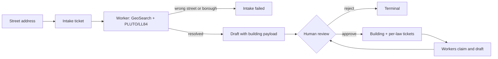

<h1 align="center">fineprint</h1>

<p align="center">
  <strong>NYC local-law compliance, run as a live ops room.</strong><br />
  Add a building and every obligation becomes a deadline-tracked ticket.
  AI workers draft the filings; a human approves every one.
</p>

<p align="center">
  
  
  
  
  
</p>

---

NYC buildings answer to a stack of local laws with real deadlines and real fines: LL97 emissions caps, LL11 facade inspections, LL84 benchmarking, LL87 audits, LL88 lighting, LL152 gas piping, LL55 allergens. fineprint tracks all of them per building, estimates the fine exposure, and runs the remediation work as a ticket queue.

Kill a worker mid-ticket. Within 15 seconds the ticket is back in the queue and another worker has it. That recovery is the demo.

---

## What it does

<table>
  <tr>
    <td width="33%" valign="top">
      <h3>Live ticket queue</h3>
      <p>Each obligation is a ticket with its statutory deadline on a timer. The dashboard reads live table subscriptions — no polling, no refresh.</p>
    </td>
    <td width="33%" valign="top">
      <h3>AI workers</h3>
      <p>Node processes claim tickets and draft the remediation or filing. Scripted playbooks by default; Claude-written drafts with <code>USE_LLM=true</code>.</p>
    </td>
    <td width="33%" valign="top">
      <h3>Crash recovery</h3>
      <p>A 5-second reaper marks workers with stale heartbeats dead and returns their tickets to the queue. No ticket is ever stranded.</p>
    </td>
  </tr>
  <tr>
    <td width="33%" valign="top">
      <h3>Human approval gate</h3>
      <p>Every draft waits for an explicit approve or reject. Building intakes always wait, even in auto-review mode. Workers cannot approve anything.</p>
    </td>
    <td width="33%" valign="top">
      <h3>Deterministic fine engine</h3>
      <p>Pure-TypeScript LL97 math: per-period emissions limits (2024–2029, 2030–2034, 2035–2039), $268/ton overage fines, and the Article 321 affordable-housing pathway.</p>
    </td>
    <td width="33%" valign="top">
      <h3>Real NYC data</h3>
      <p>Intake resolves each address through NYC GeoSearch, PLUTO, and LL84 benchmarking, so applicability and cycle dates come from real building characteristics.</p>
    </td>
  </tr>
</table>

---

## How it works

The entire backend is one SpacetimeDB module (`spacetimedb/src/`). There is no API server. The React dashboard and the Node workers connect straight to the database over WebSocket: reads are live subscriptions, writes go through reducers, and each reducer appends to an `event` audit table.

The part worth stealing: `claim_task` runs check-then-set inside one transaction, so two workers racing for a ticket can't both win. The queue, the locks, the crash reaper, the audit log: zero infrastructure code, all rows and reducers.



| Step | What happens |
|------|--------------|
| **Intake** | `request_building` queues a ticket; a worker resolves the address through NYC GeoSearch, and a geocode gate rejects wrong-street and wrong-borough matches |
| **Ingest** | Approval replays the worker's payload: the building row, its per-law obligations, and their tickets are created in one transaction |
| **Claim** | `claim_task` checks and sets ownership inside a single transaction — exactly one worker per ticket |
| **Draft** | The worker writes the remediation or filing draft and submits it for review |
| **Review** | A human approves or rejects each draft from the dashboard; every reducer writes to the audit log |
| **Recover** | The scheduled reaper returns tickets from dead workers to the open queue within seconds |

---

## Tech stack

| Layer | Tools |
|-------|-------|
| **Database + backend** | SpacetimeDB (tables, reducers, scheduler — no API server) |
| **Dashboard** | Next.js, React, Tailwind CSS, shadcn/ui, Recharts |
| **Workers** | Node.js, Anthropic SDK (Claude drafts when `USE_LLM=true`) |
| **Fine engine** | Pure TypeScript, no I/O, golden-tested (`engine/`) |
| **Building data** | NYC GeoSearch, PLUTO, LL84 benchmarking (NYC Open Data) |
| **Auth** | Clerk |
| **Hosting** | Vercel (dashboard); SpacetimeDB runs locally |

---

## Data model

```
building    (id, owner, address, bbl, bin, sqft, uses_json, annual_emissions_tco2e, compliance_plan_json, ...)
task        (id, building_id, law_id, kind, title, status, deadline, fine_estimate_usd, claimed_by)
worker      (id, identity, name, status, last_heartbeat, current_task_id)
submission  (id, task_id, worker_id, body, payload_json)
approval    (id, task_id, approved_by, verdict, note)
event       (append-only audit log — every reducer writes one row)
reaper_tick (scheduled row driving the crash reaper)

obligation / evidence / vendor / binder_event   — the owner's exportable compliance binder
```

Statuses are plain strings validated in reducers: tasks move through `open → claimed → in_review → approved | rejected → done`; workers are `idle | working | dead`. The law registry is canonical in `spacetimedb/src/laws.ts`.

---

## Running it locally

```bash
curl -sSf https://install.spacetimedb.com | sh   # CLI, once
npm install
spacetime start --listen-addr 127.0.0.1:3011     # terminal 1, keep open
npm run publish:local
WORKER_NAME=atlas npm run worker                  # terminal 2, repeat for a fleet
npm run dashboard                                 # terminal 3, port 3000
```

The database must listen on 3011 — port 3000 belongs to the Next.js dashboard,
and both the dashboard and the workers expect `ws://localhost:3011` by default.

The dashboard also needs Clerk auth keys in `client/.env.local` (Next.js reads
env files from `client/`, not the repo root):

```
NEXT_PUBLIC_CLERK_PUBLISHABLE_KEY=pk_test_...
CLERK_SECRET_KEY=sk_test_...
```

Add a building from the dashboard's address bar, or from the CLI:

```bash
spacetime call -s local fineprint request_building '"345 Park Avenue, Manhattan"'
```

After any schema or reducer change, `npm run sync` republishes the module and
regenerates the bindings for both the client and the agents.

Workers draft from canned playbooks by default. Set `USE_LLM=true` plus an
`ANTHROPIC_API_KEY` to let Claude write the drafts instead; without a key
everything still works.

### Poke it from the CLI

```bash
spacetime sql  -s local fineprint "SELECT id, status, title FROM task"
spacetime call -s local fineprint kill_worker 1
spacetime logs -s local fineprint
```

`scripts/demo-kill.md` has the 90-second demo script, including a CLI fallback that needs no frontend.

---

## Project structure

```
spacetimedb/   # the entire backend: tables, reducers, law registry (laws.ts)
client/        # Next.js dashboard — portfolio, building pages, review queue
agents/        # worker and reviewer processes; module_bindings/ are generated
engine/        # pure-TS LL97 fine math — deterministic, golden-tested
data/          # NYC Open Data ingest: GeoSearch, PLUTO, LL84, measure costs
scripts/       # law-dashboard audits, demo-kill.md walkthrough
```

---

## Honest numbers

Fine estimates come from the formulas in `engine/` and the law registry in `spacetimedb/src/laws.ts`, written from public disclosure data. Real filings need a registered design professional. The AI drafts. A human signs off on everything.
